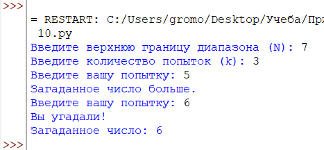
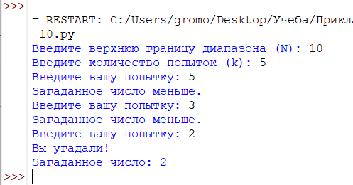
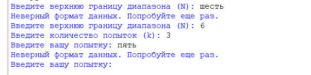

# Лабораторная №10

# Исполнитель
Громова Эльвира  
Группа ФТ-220007

# Задание
Постановка задачи:  
Компьютер загадывает число от 1 до N. У пользователя k попыток отгадать. После каждой неудачной попытки компьютер сообщает меньше или больше загаданное число. В конце игры текст с результатом (или «Вы угадали», или «Попытки закончились»).

Задание:  
Написать на любом языке программу, реализующую данную задачу.
Код программы должен содержать комментарии для созданных функций и основных блоков, а также качественный диалог с пользователем для минимизации отказов при неправильном вводе.  
Входные данные: натуральные числа N и k.  
Выходные данные: ответ на попытку ввода, ответ в конце игры.  

Добавить вызовы логгера (добавлять записи в log-файл) во все методы программы. Должна быть обязательно отражена вся вводимая и генерируемая информация: числа N и k, загаданное число, попытки пользователя, ответы программы. А также дата, время, тип и результат выполнения операций.

# Среда разработки
Язык программирования: Python  
Среда разработки: IDLE

# Инструкция по работе
При открытии файла Лабораторная 10.py необходимо ввести верхнюю границу диапазона, количество попыток. Далее попытаться угадать, загаданное компьютером, число.

# Тесты
Выполнение программы  

Тест №1 (N = 7, k = 3)

Тест №2 (N = 10, k = 5)

Тест №3 (Проверка ошибки ввода)

